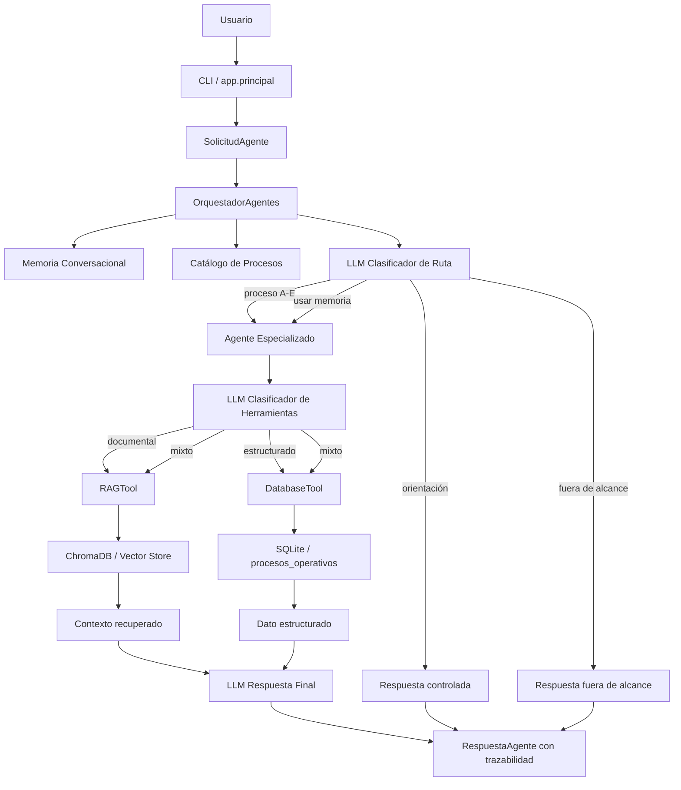
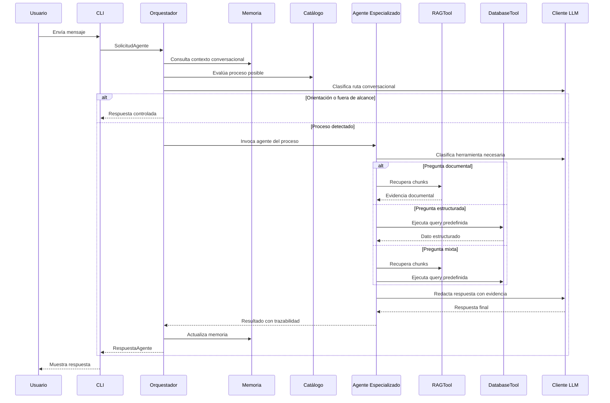
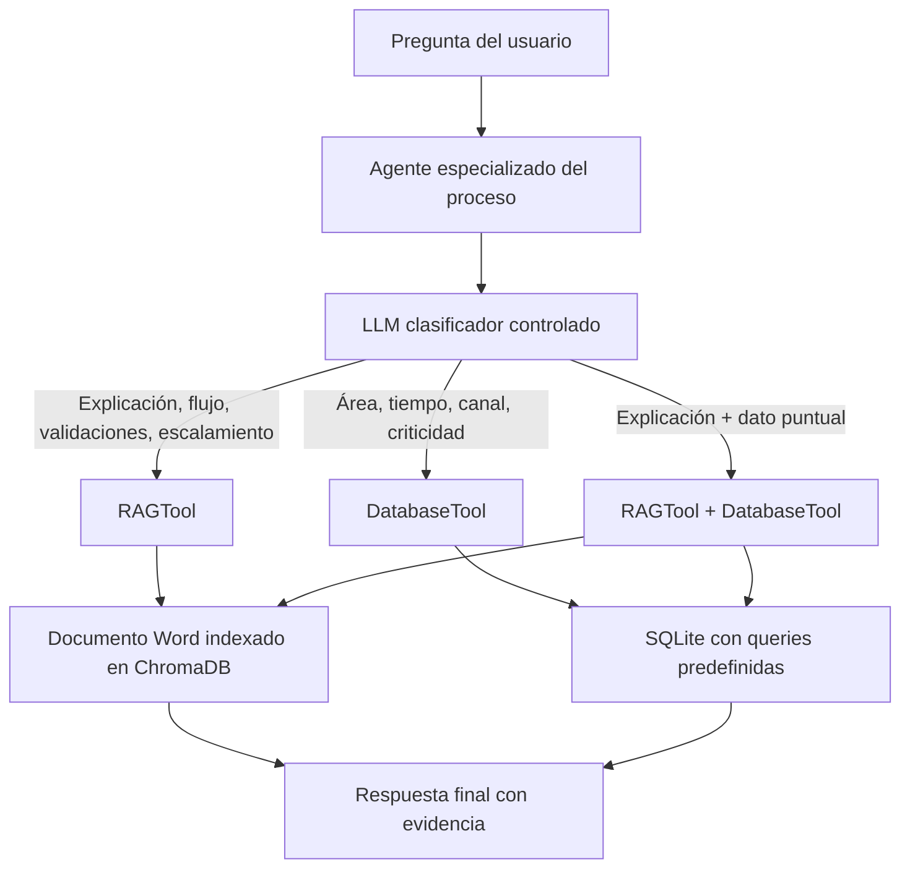
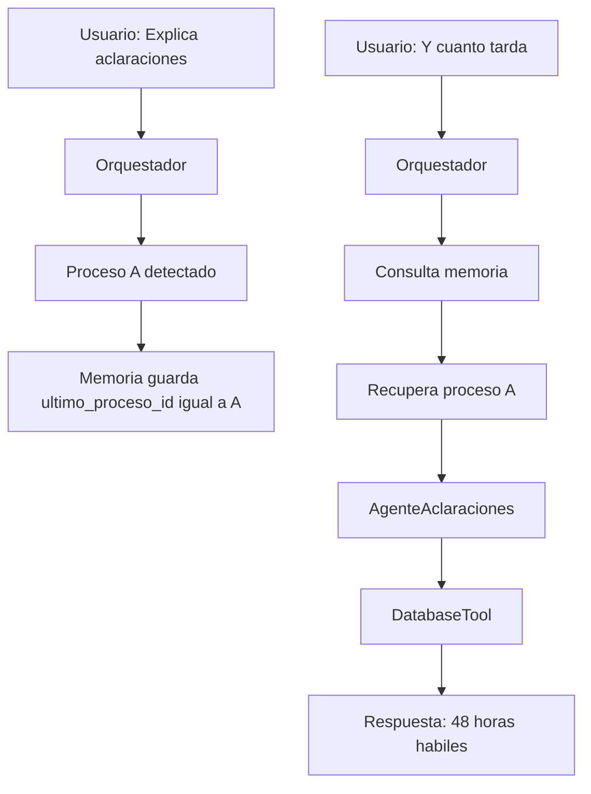

# Asistente Bancario Multiagente - BANCOMEX

Asistente conversacional interno para consultas sobre procesos operativos bancarios de BANCOMEX.  
El sistema usa arquitectura multiagente, recuperación documental mediante RAG, consultas estructuradas a una base de datos relacional y memoria conversacional en sesión.

---

## 1. Objetivo

El objetivo del proyecto es construir un asistente conversacional interno capaz de:

- Responder preguntas documentales usando RAG sobre documentos Word.
- Consultar datos estructurados en una base SQLite.
- Mantener contexto conversacional entre turnos.
- Separar responsabilidades entre orquestador, agentes especializados y herramientas.
- Entregar trazabilidad de las fuentes utilizadas: RAG y base de datos.

---

## 2. Procesos cubiertos

El sistema cubre cinco procesos operativos internos:

| Código | Proceso operativo | Agente especializado | Documento RAG |
|---|---|---|---|
| A | Atención de aclaraciones bancarias | AgenteAclaraciones | A_aclaraciones_bancarias.docx |
| B | Cancelación de productos financieros | AgenteCancelacion | B_cancelacion_productos.docx |
| C | Escalamiento de incidencias operativas | AgenteIncidencias | C_escalamiento_incidencias.docx |
| D | Actualización de datos del cliente | AgenteDatosCliente | D_actualizacion_datos_cliente.docx |
| E | Gestión de quejas internas | AgenteQuejas | E_quejas_internas.docx |

---

## 3. Arquitectura general

La arquitectura implementada sigue este flujo:

```text
CLI
↓
SolicitudAgente
↓
OrquestadorAgentes
↓
Clasificador de ruta conversacional
↓
Agente especializado
↓
Clasificador controlado de herramientas
↓
RAGTool / DatabaseTool
↓
Cliente LLM
↓
RespuestaAgente con trazabilidad
```

## 3.1 Diagrama de arquitectura



## 3.2 Flujo conversacional



## 3.3 Decisión de herramientas del agente especializado



## 3.4 Uso de memoria conversacional



